# Especificação Técnica de Arquitetura de Dados — Portal AEFP

**Documento:** Data Architecture Specification (DAS)
**Sistema:** Portal AEFP — Ecossistema de Fomento e Recursos Humanos Científicos
**Versão:** 1.0 (Produção)
**Escopo transacional:** OLTP normalizado. Camadas analíticas (dashboards, séries agregadas, KPI) são **calculadas em tempo de execução** via queries parametrizadas em PostgreSQL ou endpoints FastAPI. Nenhuma *materialized view*, tabela agregada ou *summary table* é modelada.
**Plataforma alvo:** PostgreSQL 15+, Python 3.11+, FastAPI 0.110+, SQLAlchemy 2.x, Pandas 2.x, Alembic.

---

## 1. Modelagem Conceitual e Relacional

### 1.1. Domínios do sistema

O ecossistema é dividido em cinco domínios lógicos, cuja fronteira dita a estratégia de particionamento de schemas no PostgreSQL:

| Schema | Domínio | Entidades |
|---|---|---|
| `core` | Núcleo de negócio | `programas_fomento`, `bolsistas`, `instituicoes`, `responsaveis`, `contatos`, `orcamentos_programa`, `tabela_bolsa_exterior` |
| `iam` | Identity & Access Management | `usuarios`, `perfis`, `permissoes`, `usuarios_perfis`, `perfis_permissoes` |
| `etl` | Linhagem e ingestão | `importacoes`, `importacoes_linhas`, `importacoes_erros` |
| `audit` | Auditoria global (CDC) | `registro_alteracoes_manuais`, `auditoria_global` |
| `ref` | Referenciais controlados | `dominios_guerra`, `areas_estrategicas`, `modalidades_bolsa`, `situacoes_projeto`, `situacoes_bolsa`, `tipos_ies`, `programas_catalogo` |

### 1.2. Entidades principais

#### 1.2.1. `core.programas_fomento` (entidade central absoluta)
Representa cada **projeto/proposta/auxílio** individual dentro de um programa institucional (Pró-Defesa V, Pró-Estratégia, PROPEX-DEFESA, PROCAD-DEFESA, Pró-Defesa I–IV, Álvaro Alberto). É a chave de relação por meio do `id_relacao_bolsista` (correspondente ao `ID`/`ID RELAÇÕES` da planilha original).

Atributos essenciais: identificador de negócio (`n_processo_concessao`, `n_proposta`), classificação (`programa_catalogo_id`, `area_estrategica_id`, `dominio_guerra_principal_id`, `dominio_guerra_secundario_id`), execução (`data_inicio`, `data_termino`, `situacao_id`, `qntd_bolsas`), IES líder (`instituicao_lider_id`), coordenador (`coordenador_id`), metadados (`titulo`, `resumo`, `fonte`), controle (`hash_linha`, `id_importacao_origem`).

#### 1.2.2. `core.bolsistas` (entidade secundária crítica)
Pesquisador vinculado a um Programa de Fomento via `id_relacao_bolsista`. Um bolsista pode participar de múltiplos programas ao longo do tempo (histórico), gerando N vínculos.

Atributos essenciais: identificação (`nome`, `cpf_hash`, `tipo_pessoa` [CIVIL/MILITAR/NÃO INFORMADO], `lattes_url`), vínculo acadêmico (`modalidade_bolsa_id`, `nome_ppg`, `area_ppg`), IES/OM solicitante (`instituicao_solicitante_id`), IES líder (`instituicao_lider_id`), execução (`data_inicio`, `data_finalizacao`, `situacao_bolsa_id`, `conclusao_observacao`), financeiro (`valor_pago_total`, `data_ultimo_pagamento`), país/continente (herdado de `instituicoes`).

#### 1.2.3. `core.instituicoes`
IES/OM nacionais e estrangeiras. Chave natural: `sigla` (com colisões tratadas via `sigla` + `pais`).

Atributos: `sigla`, `nome_extenso`, `pais`, `uf`, `continente`, `tipo_ies_id` (CIVIL, EB, MB, FAB, MD, CIVIL EXT., MIL EXT.), `cidade`.

#### 1.2.4. `core.responsaveis`
Coordenadores/Orientadores/Proponentes. Um responsável vincula-se a **N programas** (histórico), e um programa pode ter **N responsáveis** com funções diferentes (Coordenador Proponente, Orientador).

Atributos: `nome`, `lattes_orcid_url`, `nivel_cnpq` (1A, 1B, 1C, 1D, 2, C, VAZIO), `instituicao_id`. Relação em `core.programa_responsavel` com `funcao` e `valor_capital`/`valor_custeio` do responsável naquele projeto.

#### 1.2.5. `core.contatos`
Telefones e e-mails de responsáveis. Um responsável pode ter **N contatos** (nome+e-mail+telefone). Normalizado para permitir múltiplos e-mails/telefones sem colunas repetidas.

#### 1.2.6. `iam.usuarios`, `iam.perfis`, `iam.permissoes`
Estrutura RBAC clássica com granularidade em `recurso` + `acao`.

#### 1.2.7. `etl.importacoes`
Registro imutável (append-only) de cada execução de pipeline: quem, quando, arquivo, hash SHA-256 do XLSX, status, contagens (novos, atualizados, ignorados, erros).

#### 1.2.8. `etl.importacoes_linhas`
Linhagem linha-a-linha: mapeia cada linha da planilha para (a) entidade e ID inseridos/atualizados e (b) hash MD5 da linha para detecção de mudança.

#### 1.2.9. `audit.registro_alteracoes_manuais`
Registro específico das alterações feitas **via formulário** (não via ETL) no Portal, com contexto de negócio (motivo, campo, valor anterior, valor novo). Complementa a auditoria global com semântica humana.

#### 1.2.10. `audit.auditoria_global` (CDC baseada em triggers)
Tabela de captura de mudanças de dados **para todas** as tabelas monitoradas em `core.*` e `iam.*`. Populada por trigger `AFTER INSERT/UPDATE/DELETE`. Armazena `dados_antigos` e `dados_novos` em `JSONB`, permitindo replay e diff.

### 1.3. Matriz de cardinalidade explícita

| Entidade A | Relação | Entidade B | Cardinalidade | Regra de integridade |
|---|---|---|---|---|
| `programas_fomento` | possui | `bolsistas` | **1:N** (via `id_relacao_bolsista`) | Um programa tem 0..N bolsistas; um vínculo bolsista referencia exatamente 1 programa. |
| `bolsistas` | pode vincular-se novamente a | `programas_fomento` | **N:M no tempo** | Modelado como múltiplas linhas em `bolsistas` (uma por vínculo/período), preservando histórico de bolsas repetidas. |
| `instituicoes` | é líder de | `programas_fomento` | **1:N** | `programas_fomento.instituicao_lider_id → instituicoes.id` (NOT NULL). |
| `instituicoes` | recebe bolsista de | `bolsistas` | **1:N** | `bolsistas.instituicao_solicitante_id → instituicoes.id` (NULLABLE quando planilha omite). |
| `responsaveis` | coordena | `programas_fomento` | **N:M** | Tabela associativa `programa_responsavel` com `funcao` e valores financeiros. |
| `responsaveis` | pertence a | `instituicoes` | **N:1** | `responsaveis.instituicao_id → instituicoes.id`. |
| `contatos` | pertence a | `responsaveis` | **N:1** | `contatos.responsavel_id → responsaveis.id ON DELETE CASCADE`. |
| `programas_fomento` | classifica-se em | `programas_catalogo` | **N:1** | Catálogo controlado (Pró-Defesa V, Pró-Estratégia, etc.). |
| `programas_fomento` | possui domínio primário | `dominios_guerra` | **N:1** (obrigatório) | Domínio de guerra principal. |
| `programas_fomento` | possui domínios secundários | `dominios_guerra` | **N:M** | Tabela `programa_dominio_secundario`. |
| `programas_fomento` | possui orçamento | `orcamentos_programa` | **1:1** por catálogo | Orçamento consolidado por programa institucional (MD/CAPES/CNPQ). |
| `bolsistas` | tem modalidade | `modalidades_bolsa` | **N:1** | Mestrado, Doutorado, Pós-Doutoral, Doutorado-Sanduíche, Mestrado Profissional, Doutorado Profissional. |
| `usuarios` | assume | `perfis` | **N:M** | `iam.usuarios_perfis`. Um usuário pode acumular perfis (raro, mas suportado). |
| `perfis` | possui | `permissoes` | **N:M** | `iam.perfis_permissoes`. |
| `importacoes` | gera | `importacoes_linhas` | **1:N** | `ON DELETE CASCADE`. |
| `importacoes` | gera | `importacoes_erros` | **1:N** | `ON DELETE CASCADE`. |
| `usuarios` | executa | `importacoes` | **1:N** | `importacoes.usuario_id → iam.usuarios.id ON DELETE RESTRICT`. |
| `usuarios` | registra alteração em | `registro_alteracoes_manuais` | **1:N** | `ON DELETE RESTRICT` (preservar rastro mesmo se usuário for anonimizado). |
| Qualquer tabela auditada | gera evento em | `auditoria_global` | **1:N** | Via trigger. `ON DELETE NO ACTION`. |

---

## 2. Modelo Lógico e Diagrama ERD

### 2.1. ERD completo (Mermaid.js)

```mermaid
erDiagram
    PROGRAMAS_CATALOGO ||--o{ PROGRAMAS_FOMENTO : "categoriza"
    AREAS_ESTRATEGICAS ||--o{ PROGRAMAS_FOMENTO : "classifica"
    DOMINIOS_GUERRA ||--o{ PROGRAMAS_FOMENTO : "principal"
    DOMINIOS_GUERRA ||--o{ PROGRAMA_DOMINIO_SECUNDARIO : "secundario"
    PROGRAMAS_FOMENTO ||--o{ PROGRAMA_DOMINIO_SECUNDARIO : "possui"
    SITUACOES_PROJETO ||--o{ PROGRAMAS_FOMENTO : "estado"
    INSTITUICOES ||--|{ PROGRAMAS_FOMENTO : "lidera"
    TIPOS_IES ||--o{ INSTITUICOES : "classifica"
    INSTITUICOES ||--o{ BOLSISTAS : "solicita"
    INSTITUICOES ||--o{ BOLSISTAS : "lider"
    INSTITUICOES ||--o{ RESPONSAVEIS : "vincula"
    PROGRAMAS_FOMENTO ||--o{ BOLSISTAS : "id_relacao"
    MODALIDADES_BOLSA ||--o{ BOLSISTAS : "modalidade"
    SITUACOES_BOLSA ||--o{ BOLSISTAS : "estado"
    PROGRAMAS_FOMENTO ||--o{ PROGRAMA_RESPONSAVEL : "atribui"
    RESPONSAVEIS ||--o{ PROGRAMA_RESPONSAVEL : "atua"
    RESPONSAVEIS ||--o{ CONTATOS : "possui"
    PROGRAMAS_CATALOGO ||--|| ORCAMENTOS_PROGRAMA : "orca"
    TABELA_BOLSA_EXTERIOR ||--o{ BOLSISTAS : "referencia"
    USUARIOS ||--o{ USUARIOS_PERFIS : "assume"
    PERFIS ||--o{ USUARIOS_PERFIS : "concede"
    PERFIS ||--o{ PERFIS_PERMISSOES : "agrupa"
    PERMISSOES ||--o{ PERFIS_PERMISSOES : "atribui"
    USUARIOS ||--o{ IMPORTACOES : "executa"
    IMPORTACOES ||--|{ IMPORTACOES_LINHAS : "gera"
    IMPORTACOES ||--o{ IMPORTACOES_ERROS : "reporta"
    USUARIOS ||--o{ REGISTRO_ALTERACOES_MANUAIS : "modifica"
    USUARIOS ||--o{ AUDITORIA_GLOBAL : "origina"

    PROGRAMAS_FOMENTO {
        uuid id PK
        text n_processo_concessao UK
        text n_proposta UK
        int programa_catalogo_id FK
        text titulo
        text resumo
        int area_estrategica_id FK
        int dominio_guerra_principal_id FK
        uuid instituicao_lider_id FK
        int situacao_id FK
        smallint qntd_bolsas
        date data_inicio
        date data_termino
        text fonte
        text hash_linha
        uuid id_importacao_origem FK
        timestamptz criado_em
        timestamptz atualizado_em
    }
    BOLSISTAS {
        uuid id PK
        uuid programa_fomento_id FK
        text nome
        text cpf_hash
        text tipo_pessoa
        text lattes_url
        int modalidade_bolsa_id FK
        text nome_ppg
        text area_ppg
        uuid instituicao_solicitante_id FK
        uuid instituicao_lider_id FK
        date data_inicio
        date data_finalizacao
        int situacao_bolsa_id FK
        text conclusao_observacao
        numeric valor_pago_total
        date data_ultimo_pagamento
        text hash_linha
        uuid id_importacao_origem FK
        timestamptz criado_em
        timestamptz atualizado_em
    }
    INSTITUICOES {
        uuid id PK
        text sigla
        text nome_extenso
        text pais
        text uf
        text continente
        int tipo_ies_id FK
        text cidade
        jsonb metadados
    }
    RESPONSAVEIS {
        uuid id PK
        text nome
        text lattes_orcid_url
        text nivel_cnpq
        uuid instituicao_id FK
        timestamptz criado_em
    }
    CONTATOS {
        uuid id PK
        uuid responsavel_id FK
        text telefone
        text email
        boolean principal
    }
    PROGRAMA_RESPONSAVEL {
        uuid programa_fomento_id FK
        uuid responsavel_id FK
        text funcao
        text ppg
        text area_avaliacao
        text grande_area
        numeric valor_capital
        numeric valor_custeio
    }
    PROGRAMA_DOMINIO_SECUNDARIO {
        uuid programa_fomento_id FK
        int dominio_guerra_id FK
    }
    PROGRAMAS_CATALOGO {
        int id PK
        text nome UK
    }
    ORCAMENTOS_PROGRAMA {
        int id PK
        int programa_catalogo_id FK
        numeric valor_md
        numeric valor_capes
        numeric valor_cnpq
        numeric valor_total
    }
    AREAS_ESTRATEGICAS {
        int id PK
        text nome UK
    }
    DOMINIOS_GUERRA {
        int id PK
        text nome UK
    }
    SITUACOES_PROJETO {
        int id PK
        text nome UK
    }
    SITUACOES_BOLSA {
        int id PK
        text nome UK
    }
    MODALIDADES_BOLSA {
        int id PK
        text sigla
        text nome UK
    }
    TIPOS_IES {
        int id PK
        text sigla UK
        text descricao
    }
    TABELA_BOLSA_EXTERIOR {
        int id PK
        int modalidade_bolsa_id FK
        text pais
        text coluna_tabela
        numeric valor_mensal
    }
    USUARIOS {
        uuid id PK
        text email UK
        text nome
        text senha_hash
        boolean ativo
        timestamptz criado_em
        timestamptz ultimo_login
    }
    PERFIS {
        int id PK
        text nome UK
        text descricao
    }
    PERMISSOES {
        int id PK
        text recurso
        text acao
    }
    USUARIOS_PERFIS {
        uuid usuario_id FK
        int perfil_id FK
        timestamptz atribuido_em
    }
    PERFIS_PERMISSOES {
        int perfil_id FK
        int permissao_id FK
    }
    IMPORTACOES {
        uuid id PK
        uuid usuario_id FK
        text nome_arquivo
        text sha256_arquivo
        text status
        int total_linhas
        int total_inseridos
        int total_atualizados
        int total_ignorados
        int total_erros
        jsonb metadados
        timestamptz iniciado_em
        timestamptz finalizado_em
    }
    IMPORTACOES_LINHAS {
        uuid id PK
        uuid importacao_id FK
        int numero_linha
        text entidade_alvo
        uuid id_entidade
        text acao
        text hash_linha
        jsonb payload
    }
    IMPORTACOES_ERROS {
        uuid id PK
        uuid importacao_id FK
        int numero_linha
        text codigo_erro
        text mensagem
        jsonb contexto
    }
    REGISTRO_ALTERACOES_MANUAIS {
        uuid id PK
        uuid usuario_id FK
        text entidade
        uuid id_entidade
        text campo
        text valor_antigo
        text valor_novo
        text motivo
        timestamptz alterado_em
    }
    AUDITORIA_GLOBAL {
        uuid id PK
        text esquema
        text tabela
        uuid id_registro
        text acao
        uuid usuario_id FK
        jsonb dados_antigos
        jsonb dados_novos
        inet ip_origem
        timestamptz ocorrido_em
    }
```



### 2.2. Dicionário de dados simplificado

Legenda: **PK** primary key, **FK** foreign key, **UK** unique, **NN** not null, **DEF** default.

#### `ref.programas_catalogo`
| Coluna | Tipo lógico | Restrições |
|---|---|---|
| id | smallint | PK, autoincrement |
| nome | text | UK, NN |
| ativo | boolean | NN, DEF true |

#### `ref.areas_estrategicas`, `ref.dominios_guerra`, `ref.situacoes_projeto`, `ref.situacoes_bolsa`
Idêntico ao padrão acima (`id`, `nome UK NN`, `ativo`).

#### `ref.modalidades_bolsa`
| Coluna | Tipo lógico | Restrições |
|---|---|---|
| id | smallint | PK |
| sigla | text | UK (PDE, SWE, MP, DP, MEST, DOUT, PD) |
| nome | text | UK, NN |

#### `ref.tipos_ies`
| Coluna | Tipo lógico | Restrições |
|---|---|---|
| id | smallint | PK |
| sigla | text | UK, NN (CIVIL, EB, MB, FAB, MD, CIVIL EXT., MIL EXT.) |
| descricao | text | NN |

#### `core.instituicoes`
| Coluna | Tipo lógico | Restrições |
|---|---|---|
| id | uuid | PK, DEF gen_random_uuid() |
| sigla | text | NN |
| nome_extenso | text | NN |
| pais | text | NN |
| uf | text | nullable |
| cidade | text | nullable |
| continente | text | NN |
| tipo_ies_id | smallint | FK → ref.tipos_ies, NN |
| metadados | jsonb | DEF '{}'::jsonb |
| criado_em | timestamptz | NN, DEF now() |
| — | — | UK (sigla, pais) |

#### `core.programas_fomento`
| Coluna | Tipo lógico | Restrições |
|---|---|---|
| id | uuid | PK, DEF gen_random_uuid() |
| id_negocio | integer | UK NN (equivale ao `ID` da planilha) |
| n_processo_concessao | text | UK nullable |
| n_proposta | text | UK nullable |
| programa_catalogo_id | smallint | FK, NN |
| titulo | text | NN |
| resumo | text | nullable |
| area_estrategica_id | smallint | FK, nullable |
| dominio_guerra_principal_id | smallint | FK, nullable |
| instituicao_lider_id | uuid | FK, NN |
| coordenador_id | uuid | FK → responsaveis, nullable |
| situacao_id | smallint | FK, NN |
| qntd_bolsas | smallint | nullable, CHECK ≥ 0 |
| data_inicio | date | nullable |
| data_termino | date | nullable, CHECK ≥ data_inicio |
| fonte | text | nullable |
| hash_linha | text | NN (SHA-256 hex) |
| id_importacao_origem | uuid | FK → etl.importacoes, nullable |
| criado_em | timestamptz | NN, DEF now() |
| atualizado_em | timestamptz | NN, DEF now() |

#### `core.programa_dominio_secundario`
| Coluna | Tipo | Restrições |
|---|---|---|
| programa_fomento_id | uuid | FK, NN |
| dominio_guerra_id | smallint | FK, NN |
| — | — | PK (programa_fomento_id, dominio_guerra_id) |

#### `core.bolsistas`
| Coluna | Tipo lógico | Restrições |
|---|---|---|
| id | uuid | PK, DEF gen_random_uuid() |
| programa_fomento_id | uuid | FK, NN |
| nome | text | NN |
| cpf_hash | text | nullable (SHA-256) |
| tipo_pessoa | text | CHECK IN ('CIVIL','MILITAR','NÃO INFORMADO') |
| lattes_url | text | nullable |
| modalidade_bolsa_id | smallint | FK, NN |
| nome_ppg | text | nullable |
| area_ppg | text | nullable |
| instituicao_solicitante_id | uuid | FK, nullable |
| instituicao_lider_id | uuid | FK, nullable |
| data_inicio | date | nullable |
| data_finalizacao | date | nullable |
| situacao_bolsa_id | smallint | FK, NN |
| conclusao_observacao | text | nullable |
| valor_pago_total | numeric(14,2) | nullable |
| data_ultimo_pagamento | date | nullable |
| hash_linha | text | NN |
| id_importacao_origem | uuid | FK, nullable |
| criado_em | timestamptz | NN, DEF now() |
| atualizado_em | timestamptz | NN, DEF now() |

#### `core.responsaveis`
| Coluna | Tipo | Restrições |
|---|---|---|
| id | uuid | PK |
| nome | text | NN |
| lattes_orcid_url | text | nullable |
| nivel_cnpq | text | nullable |
| instituicao_id | uuid | FK, nullable |
| criado_em | timestamptz | NN, DEF now() |

#### `core.programa_responsavel`
| Coluna | Tipo | Restrições |
|---|---|---|
| programa_fomento_id | uuid | FK, NN |
| responsavel_id | uuid | FK, NN |
| funcao | text | NN CHECK IN ('Coordenador Proponente','Orientador','Co-orientador','Tutor','Supervisor') |
| ppg | text | nullable |
| area_avaliacao | text | nullable |
| grande_area | text | nullable |
| valor_capital | numeric(14,2) | nullable |
| valor_custeio | numeric(14,2) | nullable |
| — | — | PK (programa_fomento_id, responsavel_id, funcao) |

#### `core.contatos`
| Coluna | Tipo | Restrições |
|---|---|---|
| id | uuid | PK |
| responsavel_id | uuid | FK, NN, ON DELETE CASCADE |
| telefone | text | nullable |
| email | text | nullable, CHECK regex |
| principal | boolean | NN, DEF false |
| — | — | CHECK (telefone IS NOT NULL OR email IS NOT NULL) |

#### `core.orcamentos_programa`
| Coluna | Tipo | Restrições |
|---|---|---|
| id | smallint | PK |
| programa_catalogo_id | smallint | UK FK, NN |
| valor_md | numeric(16,2) | DEF 0 |
| valor_capes | numeric(16,2) | DEF 0 |
| valor_cnpq | numeric(16,2) | DEF 0 |
| valor_total | numeric(16,2) | GENERATED ALWAYS AS (valor_md + valor_capes + valor_cnpq) STORED |

#### `core.tabela_bolsa_exterior`
| Coluna | Tipo | Restrições |
|---|---|---|
| id | integer | PK |
| modalidade_bolsa_id | smallint | FK, NN |
| pais | text | NN |
| coluna_tabela | text | NN (EUA, Zona do Euro, Reino Unido, Canadá, USD/Europa, etc.) |
| valor_mensal | numeric(12,2) | NN CHECK > 0 |
| — | — | UK (modalidade_bolsa_id, pais) |

#### `iam.usuarios`, `iam.perfis`, `iam.permissoes`, `iam.usuarios_perfis`, `iam.perfis_permissoes`
Ver seção 3 (DDL completo).

#### `etl.importacoes`, `etl.importacoes_linhas`, `etl.importacoes_erros`
Ver seção 3 e 4.

#### `audit.registro_alteracoes_manuais`, `audit.auditoria_global`
Ver seção 3 e 5.

---

## 3. Modelo Físico e Script SQL PostgreSQL (DDL)

Script completo, executável em PostgreSQL 15+ como um único transação. Cria extensões, schemas, tipos, tabelas, índices, funções e triggers.

```sql
-- =====================================================================
-- Portal AEFP — Data Architecture DDL
-- PostgreSQL 15+
-- =====================================================================

BEGIN;

-- ---------- Extensões ----------
CREATE EXTENSION IF NOT EXISTS "pgcrypto";      -- gen_random_uuid()
CREATE EXTENSION IF NOT EXISTS "citext";        -- e-mails case-insensitive
CREATE EXTENSION IF NOT EXISTS "pg_trgm";       -- busca fuzzy em nomes
CREATE EXTENSION IF NOT EXISTS "btree_gin";     -- índices GIN combinados

-- ---------- Schemas ----------
CREATE SCHEMA IF NOT EXISTS ref;
CREATE SCHEMA IF NOT EXISTS core;
CREATE SCHEMA IF NOT EXISTS iam;
CREATE SCHEMA IF NOT EXISTS etl;
CREATE SCHEMA IF NOT EXISTS audit;

COMMENT ON SCHEMA ref  IS 'Tabelas referenciais/enumerativas controladas';
COMMENT ON SCHEMA core IS 'Entidades transacionais de negócio';
COMMENT ON SCHEMA iam  IS 'Identity & Access Management (RBAC)';
COMMENT ON SCHEMA etl  IS 'Linhagem de ingestão de planilhas';
COMMENT ON SCHEMA audit IS 'CDC via triggers e alterações manuais';

-- =====================================================================
-- REF: catálogos controlados
-- =====================================================================
CREATE TABLE ref.programas_catalogo (
    id       SMALLSERIAL PRIMARY KEY,
    nome     TEXT NOT NULL UNIQUE,
    ativo    BOOLEAN NOT NULL DEFAULT TRUE
);

CREATE TABLE ref.areas_estrategicas (
    id       SMALLSERIAL PRIMARY KEY,
    nome     TEXT NOT NULL UNIQUE,
    ativo    BOOLEAN NOT NULL DEFAULT TRUE
);

CREATE TABLE ref.dominios_guerra (
    id       SMALLSERIAL PRIMARY KEY,
    nome     TEXT NOT NULL UNIQUE,
    ativo    BOOLEAN NOT NULL DEFAULT TRUE
);

CREATE TABLE ref.situacoes_projeto (
    id       SMALLSERIAL PRIMARY KEY,
    nome     TEXT NOT NULL UNIQUE,
    ativo    BOOLEAN NOT NULL DEFAULT TRUE
);

CREATE TABLE ref.situacoes_bolsa (
    id       SMALLSERIAL PRIMARY KEY,
    nome     TEXT NOT NULL UNIQUE,
    ativo    BOOLEAN NOT NULL DEFAULT TRUE
);

CREATE TABLE ref.modalidades_bolsa (
    id       SMALLSERIAL PRIMARY KEY,
    sigla    TEXT NOT NULL UNIQUE,
    nome     TEXT NOT NULL UNIQUE
);

CREATE TABLE ref.tipos_ies (
    id         SMALLSERIAL PRIMARY KEY,
    sigla      TEXT NOT NULL UNIQUE,
    descricao  TEXT NOT NULL
);

-- Seeds mínimos derivados do DataCenter AEFP
INSERT INTO ref.programas_catalogo (nome) VALUES
    ('Pró-Defesa I'), ('Pró-Defesa II'), ('Pró-Defesa III'),
    ('Pró-Defesa IV'), ('Pró-Defesa V'),
    ('PROPEX-DEFESA'), ('PROCAD-DEFESA'),
    ('PRÓ-ESTRATÉGIA'), ('Álvaro Alberto');

INSERT INTO ref.situacoes_projeto (nome) VALUES
    ('EM EXECUÇÃO'), ('CONCLUÍDO'), ('CANCELADO'),
    ('PREVISTO'), ('ENCERRADO');

INSERT INTO ref.situacoes_bolsa (nome) VALUES
    ('Em Execução'), ('Encerrado'), ('Cancelado'),
    ('Vigente'), ('Previsto'), ('Vigência Expirada');

INSERT INTO ref.modalidades_bolsa (sigla, nome) VALUES
    ('MEST',  'MESTRADO'),
    ('DOUT',  'DOUTORADO'),
    ('MP',    'MESTRADO PROFISSIONAL'),
    ('DP',    'DOUTORADO PROFISSIONAL'),
    ('PD',    'ESTÁGIO PÓS-DOUTORAL'),
    ('PDE',   'PÓS DOUTORADO'),
    ('SWE',   'DOUTORADO-SANDUICHE');

INSERT INTO ref.tipos_ies (sigla, descricao) VALUES
    ('CIVIL',      'Instituição civil nacional'),
    ('EB',         'Exército Brasileiro'),
    ('MB',         'Marinha do Brasil'),
    ('FAB',        'Força Aérea Brasileira'),
    ('MD',         'Ministério da Defesa'),
    ('CIVIL EXT.', 'Instituição civil estrangeira'),
    ('MIL EXT.',   'Instituição militar estrangeira');

-- =====================================================================
-- CORE: entidades de negócio
-- =====================================================================
CREATE TABLE core.instituicoes (
    id             UUID PRIMARY KEY DEFAULT gen_random_uuid(),
    sigla          TEXT NOT NULL,
    nome_extenso   TEXT NOT NULL,
    pais           TEXT NOT NULL,
    uf             TEXT,
    cidade         TEXT,
    continente     TEXT NOT NULL,
    tipo_ies_id    SMALLINT NOT NULL REFERENCES ref.tipos_ies(id) ON DELETE RESTRICT,
    metadados      JSONB NOT NULL DEFAULT '{}'::JSONB,
    criado_em      TIMESTAMPTZ NOT NULL DEFAULT NOW(),
    atualizado_em  TIMESTAMPTZ NOT NULL DEFAULT NOW(),
    CONSTRAINT uk_instituicoes_sigla_pais UNIQUE (sigla, pais)
);

CREATE INDEX ix_instituicoes_tipo         ON core.instituicoes(tipo_ies_id);
CREATE INDEX ix_instituicoes_pais         ON core.instituicoes(pais);
CREATE INDEX ix_instituicoes_continente   ON core.instituicoes(continente);
CREATE INDEX ix_instituicoes_nome_trgm    ON core.instituicoes USING gin (nome_extenso gin_trgm_ops);
CREATE INDEX ix_instituicoes_metadados    ON core.instituicoes USING gin (metadados);

CREATE TABLE core.responsaveis (
    id                 UUID PRIMARY KEY DEFAULT gen_random_uuid(),
    nome               TEXT NOT NULL,
    lattes_orcid_url   TEXT,
    nivel_cnpq         TEXT,
    instituicao_id     UUID REFERENCES core.instituicoes(id) ON DELETE SET NULL,
    criado_em          TIMESTAMPTZ NOT NULL DEFAULT NOW(),
    atualizado_em      TIMESTAMPTZ NOT NULL DEFAULT NOW()
);

CREATE INDEX ix_responsaveis_nome_trgm    ON core.responsaveis USING gin (nome gin_trgm_ops);
CREATE INDEX ix_responsaveis_instituicao  ON core.responsaveis(instituicao_id);

CREATE TABLE core.contatos (
    id              UUID PRIMARY KEY DEFAULT gen_random_uuid(),
    responsavel_id  UUID NOT NULL REFERENCES core.responsaveis(id) ON DELETE CASCADE,
    telefone        TEXT,
    email           CITEXT,
    principal       BOOLEAN NOT NULL DEFAULT FALSE,
    criado_em       TIMESTAMPTZ NOT NULL DEFAULT NOW(),
    CONSTRAINT ck_contatos_ao_menos_um CHECK (telefone IS NOT NULL OR email IS NOT NULL),
    CONSTRAINT ck_contatos_email_fmt   CHECK (
        email IS NULL OR email ~* '^[A-Z0-9._%+-]+@[A-Z0-9.-]+\.[A-Z]{2,}$'
    )
);

CREATE INDEX ix_contatos_responsavel ON core.contatos(responsavel_id);
CREATE INDEX ix_contatos_email       ON core.contatos(email);

CREATE TABLE core.programas_fomento (
    id                             UUID PRIMARY KEY DEFAULT gen_random_uuid(),
    id_negocio                     INTEGER NOT NULL UNIQUE,
    n_processo_concessao           TEXT UNIQUE,
    n_proposta                     TEXT UNIQUE,
    programa_catalogo_id           SMALLINT NOT NULL REFERENCES ref.programas_catalogo(id) ON DELETE RESTRICT,
    titulo                         TEXT NOT NULL,
    resumo                         TEXT,
    area_estrategica_id            SMALLINT REFERENCES ref.areas_estrategicas(id) ON DELETE RESTRICT,
    dominio_guerra_principal_id    SMALLINT REFERENCES ref.dominios_guerra(id) ON DELETE RESTRICT,
    instituicao_lider_id           UUID NOT NULL REFERENCES core.instituicoes(id) ON DELETE RESTRICT,
    coordenador_id                 UUID REFERENCES core.responsaveis(id) ON DELETE SET NULL,
    situacao_id                    SMALLINT NOT NULL REFERENCES ref.situacoes_projeto(id) ON DELETE RESTRICT,
    qntd_bolsas                    SMALLINT CHECK (qntd_bolsas IS NULL OR qntd_bolsas >= 0),
    data_inicio                    DATE,
    data_termino                   DATE,
    fonte                          TEXT,
    hash_linha                     TEXT NOT NULL,
    id_importacao_origem           UUID,   -- FK adicionada após ETL
    criado_em                      TIMESTAMPTZ NOT NULL DEFAULT NOW(),
    atualizado_em                  TIMESTAMPTZ NOT NULL DEFAULT NOW(),
    CONSTRAINT ck_prog_datas_ordem CHECK (
        data_inicio IS NULL OR data_termino IS NULL OR data_termino >= data_inicio
    )
);

CREATE INDEX ix_prog_catalogo        ON core.programas_fomento(programa_catalogo_id);
CREATE INDEX ix_prog_situacao        ON core.programas_fomento(situacao_id);
CREATE INDEX ix_prog_area            ON core.programas_fomento(area_estrategica_id);
CREATE INDEX ix_prog_dominio         ON core.programas_fomento(dominio_guerra_principal_id);
CREATE INDEX ix_prog_ies_lider       ON core.programas_fomento(instituicao_lider_id);
CREATE INDEX ix_prog_coordenador     ON core.programas_fomento(coordenador_id);
CREATE INDEX ix_prog_datas           ON core.programas_fomento(data_inicio, data_termino);
CREATE INDEX ix_prog_titulo_trgm     ON core.programas_fomento USING gin (titulo gin_trgm_ops);
CREATE INDEX ix_prog_resumo_trgm     ON core.programas_fomento USING gin (resumo gin_trgm_ops);
-- Índice composto para consulta chave de negócio:
CREATE INDEX ix_prog_neg_proc        ON core.programas_fomento(n_processo_concessao, n_proposta);

CREATE TABLE core.programa_dominio_secundario (
    programa_fomento_id  UUID     NOT NULL REFERENCES core.programas_fomento(id) ON DELETE CASCADE,
    dominio_guerra_id    SMALLINT NOT NULL REFERENCES ref.dominios_guerra(id)    ON DELETE RESTRICT,
    PRIMARY KEY (programa_fomento_id, dominio_guerra_id)
);

CREATE INDEX ix_pds_dominio ON core.programa_dominio_secundario(dominio_guerra_id);

CREATE TABLE core.bolsistas (
    id                            UUID PRIMARY KEY DEFAULT gen_random_uuid(),
    programa_fomento_id           UUID NOT NULL REFERENCES core.programas_fomento(id) ON DELETE RESTRICT,
    nome                          TEXT NOT NULL,
    cpf_hash                      TEXT,
    tipo_pessoa                   TEXT NOT NULL DEFAULT 'NÃO INFORMADO'
                                  CHECK (tipo_pessoa IN ('CIVIL','MILITAR','NÃO INFORMADO')),
    lattes_url                    TEXT,
    modalidade_bolsa_id           SMALLINT NOT NULL REFERENCES ref.modalidades_bolsa(id) ON DELETE RESTRICT,
    nome_ppg                      TEXT,
    area_ppg                      TEXT,
    instituicao_solicitante_id    UUID REFERENCES core.instituicoes(id) ON DELETE SET NULL,
    instituicao_lider_id          UUID REFERENCES core.instituicoes(id) ON DELETE SET NULL,
    data_inicio                   DATE,
    data_finalizacao              DATE,
    situacao_bolsa_id             SMALLINT NOT NULL REFERENCES ref.situacoes_bolsa(id) ON DELETE RESTRICT,
    conclusao_observacao          TEXT,
    valor_pago_total              NUMERIC(14,2) CHECK (valor_pago_total IS NULL OR valor_pago_total >= 0),
    data_ultimo_pagamento         DATE,
    hash_linha                    TEXT NOT NULL,
    id_importacao_origem          UUID,
    criado_em                     TIMESTAMPTZ NOT NULL DEFAULT NOW(),
    atualizado_em                 TIMESTAMPTZ NOT NULL DEFAULT NOW(),
    CONSTRAINT ck_bols_datas_ordem CHECK (
        data_inicio IS NULL OR data_finalizacao IS NULL OR data_finalizacao >= data_inicio
    )
);

CREATE INDEX ix_bols_programa       ON core.bolsistas(programa_fomento_id);
CREATE INDEX ix_bols_modalidade     ON core.bolsistas(modalidade_bolsa_id);
CREATE INDEX ix_bols_situacao       ON core.bolsistas(situacao_bolsa_id);
CREATE INDEX ix_bols_ies_solic      ON core.bolsistas(instituicao_solicitante_id);
CREATE INDEX ix_bols_ies_lider      ON core.bolsistas(instituicao_lider_id);
CREATE INDEX ix_bols_datas          ON core.bolsistas(data_inicio, data_finalizacao);
CREATE INDEX ix_bols_nome_trgm      ON core.bolsistas USING gin (nome gin_trgm_ops);
-- Índice composto para queries analíticas frequentes (agrupamento por programa+modalidade+situação):
CREATE INDEX ix_bols_prog_mod_sit   ON core.bolsistas(programa_fomento_id, modalidade_bolsa_id, situacao_bolsa_id);

CREATE TABLE core.programa_responsavel (
    programa_fomento_id  UUID NOT NULL REFERENCES core.programas_fomento(id) ON DELETE CASCADE,
    responsavel_id       UUID NOT NULL REFERENCES core.responsaveis(id)      ON DELETE RESTRICT,
    funcao               TEXT NOT NULL CHECK (funcao IN (
        'Coordenador Proponente','Orientador','Co-orientador','Tutor','Supervisor'
    )),
    ppg                  TEXT,
    area_avaliacao       TEXT,
    grande_area          TEXT,
    valor_capital        NUMERIC(14,2) CHECK (valor_capital IS NULL OR valor_capital >= 0),
    valor_custeio        NUMERIC(14,2) CHECK (valor_custeio IS NULL OR valor_custeio >= 0),
    criado_em            TIMESTAMPTZ NOT NULL DEFAULT NOW(),
    PRIMARY KEY (programa_fomento_id, responsavel_id, funcao)
);

CREATE INDEX ix_pr_responsavel ON core.programa_responsavel(responsavel_id);

CREATE TABLE core.orcamentos_programa (
    id                    SMALLSERIAL PRIMARY KEY,
    programa_catalogo_id  SMALLINT NOT NULL UNIQUE REFERENCES ref.programas_catalogo(id) ON DELETE RESTRICT,
    valor_md              NUMERIC(16,2) NOT NULL DEFAULT 0 CHECK (valor_md >= 0),
    valor_capes           NUMERIC(16,2) NOT NULL DEFAULT 0 CHECK (valor_capes >= 0),
    valor_cnpq            NUMERIC(16,2) NOT NULL DEFAULT 0 CHECK (valor_cnpq >= 0),
    valor_total           NUMERIC(16,2) GENERATED ALWAYS AS (valor_md + valor_capes + valor_cnpq) STORED,
    atualizado_em         TIMESTAMPTZ NOT NULL DEFAULT NOW()
);

CREATE TABLE core.tabela_bolsa_exterior (
    id                    SERIAL PRIMARY KEY,
    modalidade_bolsa_id   SMALLINT NOT NULL REFERENCES ref.modalidades_bolsa(id) ON DELETE RESTRICT,
    pais                  TEXT NOT NULL,
    coluna_tabela         TEXT NOT NULL,
    valor_mensal          NUMERIC(12,2) NOT NULL CHECK (valor_mensal > 0),
    observacao            TEXT,
    vigencia_inicio       DATE NOT NULL DEFAULT CURRENT_DATE,
    UNIQUE (modalidade_bolsa_id, pais, vigencia_inicio)
);

-- =====================================================================
-- IAM: RBAC
-- =====================================================================
CREATE TABLE iam.usuarios (
    id             UUID PRIMARY KEY DEFAULT gen_random_uuid(),
    email          CITEXT NOT NULL UNIQUE,
    nome           TEXT NOT NULL,
    senha_hash     TEXT NOT NULL,       -- Argon2id / bcrypt
    ativo          BOOLEAN NOT NULL DEFAULT TRUE,
    ultimo_login   TIMESTAMPTZ,
    criado_em      TIMESTAMPTZ NOT NULL DEFAULT NOW(),
    atualizado_em  TIMESTAMPTZ NOT NULL DEFAULT NOW()
);

CREATE TABLE iam.perfis (
    id        SMALLSERIAL PRIMARY KEY,
    nome      TEXT NOT NULL UNIQUE,
    descricao TEXT NOT NULL
);

CREATE TABLE iam.permissoes (
    id       SERIAL PRIMARY KEY,
    recurso  TEXT NOT NULL,     -- ex: 'programas_fomento','bolsistas','importacoes'
    acao     TEXT NOT NULL CHECK (acao IN ('READ','CREATE','UPDATE','DELETE','IMPORT','ADMIN')),
    UNIQUE (recurso, acao)
);

CREATE TABLE iam.usuarios_perfis (
    usuario_id     UUID NOT NULL REFERENCES iam.usuarios(id) ON DELETE CASCADE,
    perfil_id      SMALLINT NOT NULL REFERENCES iam.perfis(id) ON DELETE RESTRICT,
    atribuido_em   TIMESTAMPTZ NOT NULL DEFAULT NOW(),
    atribuido_por  UUID REFERENCES iam.usuarios(id) ON DELETE SET NULL,
    PRIMARY KEY (usuario_id, perfil_id)
);

CREATE TABLE iam.perfis_permissoes (
    perfil_id     SMALLINT NOT NULL REFERENCES iam.perfis(id) ON DELETE CASCADE,
    permissao_id  INTEGER  NOT NULL REFERENCES iam.permissoes(id) ON DELETE CASCADE,
    PRIMARY KEY (perfil_id, permissao_id)
);

-- Seeds RBAC
INSERT INTO iam.perfis (nome, descricao) VALUES
    ('Admin',        'Acesso total, incluindo gestão de usuários e permissões'),
    ('Editor',       'Pode importar planilhas e alterar registros via formulário; não pode deletar'),
    ('Visualizador', 'Acesso estrito de leitura');

INSERT INTO iam.permissoes (recurso, acao) VALUES
    ('programas_fomento','READ'), ('programas_fomento','CREATE'),
    ('programas_fomento','UPDATE'),('programas_fomento','DELETE'),
    ('bolsistas','READ'), ('bolsistas','CREATE'),
    ('bolsistas','UPDATE'),('bolsistas','DELETE'),
    ('instituicoes','READ'),('instituicoes','CREATE'),
    ('instituicoes','UPDATE'),('instituicoes','DELETE'),
    ('responsaveis','READ'),('responsaveis','CREATE'),
    ('responsaveis','UPDATE'),('responsaveis','DELETE'),
    ('importacoes','READ'),('importacoes','IMPORT'),
    ('auditoria','READ'),
    ('usuarios','READ'),('usuarios','CREATE'),
    ('usuarios','UPDATE'),('usuarios','DELETE'),
    ('sistema','ADMIN');

-- Admin: todas
INSERT INTO iam.perfis_permissoes (perfil_id, permissao_id)
SELECT (SELECT id FROM iam.perfis WHERE nome='Admin'), p.id FROM iam.permissoes p;

-- Editor: tudo EXCETO DELETE e tudo em usuarios/sistema
INSERT INTO iam.perfis_permissoes (perfil_id, permissao_id)
SELECT (SELECT id FROM iam.perfis WHERE nome='Editor'), p.id
FROM iam.permissoes p
WHERE p.acao IN ('READ','CREATE','UPDATE','IMPORT')
  AND p.recurso NOT IN ('usuarios','sistema');

-- Visualizador: somente READ, exceto usuarios/sistema/auditoria
INSERT INTO iam.perfis_permissoes (perfil_id, permissao_id)
SELECT (SELECT id FROM iam.perfis WHERE nome='Visualizador'), p.id
FROM iam.permissoes p
WHERE p.acao='READ'
  AND p.recurso NOT IN ('usuarios','sistema','auditoria');

-- =====================================================================
-- ETL: linhagem
-- =====================================================================
CREATE TABLE etl.importacoes (
    id                 UUID PRIMARY KEY DEFAULT gen_random_uuid(),
    usuario_id         UUID NOT NULL REFERENCES iam.usuarios(id) ON DELETE RESTRICT,
    nome_arquivo       TEXT NOT NULL,
    sha256_arquivo     TEXT NOT NULL,
    status             TEXT NOT NULL DEFAULT 'RUNNING'
                       CHECK (status IN ('RUNNING','SUCCESS','PARTIAL','FAILED')),
    total_linhas       INTEGER NOT NULL DEFAULT 0,
    total_inseridos    INTEGER NOT NULL DEFAULT 0,
    total_atualizados  INTEGER NOT NULL DEFAULT 0,
    total_ignorados    INTEGER NOT NULL DEFAULT 0,
    total_erros        INTEGER NOT NULL DEFAULT 0,
    metadados          JSONB NOT NULL DEFAULT '{}'::JSONB,
    iniciado_em        TIMESTAMPTZ NOT NULL DEFAULT NOW(),
    finalizado_em      TIMESTAMPTZ,
    -- Idempotência: mesmo arquivo (mesmo hash) não pode ser reprocessado com sucesso 2x
    CONSTRAINT uk_import_sha_success UNIQUE (sha256_arquivo, status) DEFERRABLE INITIALLY DEFERRED
);

CREATE INDEX ix_import_usuario ON etl.importacoes(usuario_id);
CREATE INDEX ix_import_status  ON etl.importacoes(status);
CREATE INDEX ix_import_iniciado ON etl.importacoes(iniciado_em DESC);

CREATE TABLE etl.importacoes_linhas (
    id             UUID PRIMARY KEY DEFAULT gen_random_uuid(),
    importacao_id  UUID NOT NULL REFERENCES etl.importacoes(id) ON DELETE CASCADE,
    numero_linha   INTEGER NOT NULL,
    entidade_alvo  TEXT NOT NULL CHECK (entidade_alvo IN (
        'programas_fomento','bolsistas','instituicoes','responsaveis','contatos'
    )),
    id_entidade    UUID,
    acao           TEXT NOT NULL CHECK (acao IN ('INSERT','UPDATE','SKIP')),
    hash_linha     TEXT NOT NULL,
    payload        JSONB NOT NULL,
    processado_em  TIMESTAMPTZ NOT NULL DEFAULT NOW()
);

CREATE INDEX ix_impl_importacao   ON etl.importacoes_linhas(importacao_id);
CREATE INDEX ix_impl_entidade     ON etl.importacoes_linhas(entidade_alvo, id_entidade);
CREATE INDEX ix_impl_hash         ON etl.importacoes_linhas(hash_linha);
CREATE INDEX ix_impl_payload_gin  ON etl.importacoes_linhas USING gin (payload);

CREATE TABLE etl.importacoes_erros (
    id             UUID PRIMARY KEY DEFAULT gen_random_uuid(),
    importacao_id  UUID NOT NULL REFERENCES etl.importacoes(id) ON DELETE CASCADE,
    numero_linha   INTEGER NOT NULL,
    codigo_erro    TEXT NOT NULL,   -- 'FK_INSTITUICAO_NAO_ENCONTRADA','DATA_INVALIDA', etc.
    mensagem       TEXT NOT NULL,
    contexto       JSONB NOT NULL DEFAULT '{}'::JSONB,
    registrado_em  TIMESTAMPTZ NOT NULL DEFAULT NOW()
);

CREATE INDEX ix_impe_importacao ON etl.importacoes_erros(importacao_id);
CREATE INDEX ix_impe_codigo     ON etl.importacoes_erros(codigo_erro);

-- FKs de origem em core (adicionadas após criar etl.importacoes)
ALTER TABLE core.programas_fomento
    ADD CONSTRAINT fk_prog_import_origem
    FOREIGN KEY (id_importacao_origem)
    REFERENCES etl.importacoes(id) ON DELETE SET NULL;

ALTER TABLE core.bolsistas
    ADD CONSTRAINT fk_bols_import_origem
    FOREIGN KEY (id_importacao_origem)
    REFERENCES etl.importacoes(id) ON DELETE SET NULL;

-- =====================================================================
-- AUDIT: alterações manuais + CDC global
-- =====================================================================
CREATE TABLE audit.registro_alteracoes_manuais (
    id             UUID PRIMARY KEY DEFAULT gen_random_uuid(),
    usuario_id     UUID NOT NULL REFERENCES iam.usuarios(id) ON DELETE RESTRICT,
    entidade       TEXT NOT NULL,
    id_entidade    UUID NOT NULL,
    campo          TEXT NOT NULL,
    valor_antigo   TEXT,
    valor_novo     TEXT,
    motivo         TEXT,
    ip_origem      INET,
    alterado_em    TIMESTAMPTZ NOT NULL DEFAULT NOW()
);

CREATE INDEX ix_ram_entidade   ON audit.registro_alteracoes_manuais(entidade, id_entidade);
CREATE INDEX ix_ram_usuario    ON audit.registro_alteracoes_manuais(usuario_id);
CREATE INDEX ix_ram_data       ON audit.registro_alteracoes_manuais(alterado_em DESC);

CREATE TABLE audit.auditoria_global (
    id              BIGSERIAL PRIMARY KEY,
    esquema         TEXT NOT NULL,
    tabela          TEXT NOT NULL,
    id_registro     TEXT NOT NULL,     -- string para tolerar PKs não-UUID
    acao            TEXT NOT NULL CHECK (acao IN ('INSERT','UPDATE','DELETE')),
    usuario_id      UUID REFERENCES iam.usuarios(id) ON DELETE SET NULL,
    dados_antigos   JSONB,
    dados_novos     JSONB,
    ip_origem       INET,
    ocorrido_em     TIMESTAMPTZ NOT NULL DEFAULT NOW()
);

CREATE INDEX ix_ag_tabela_registro ON audit.auditoria_global(esquema, tabela, id_registro);
CREATE INDEX ix_ag_usuario         ON audit.auditoria_global(usuario_id);
CREATE INDEX ix_ag_ocorrido        ON audit.auditoria_global(ocorrido_em DESC);
CREATE INDEX ix_ag_dados_novos     ON audit.auditoria_global USING gin (dados_novos);
CREATE INDEX ix_ag_dados_antigos   ON audit.auditoria_global USING gin (dados_antigos);

-- Particionamento futuro por mês (sugestão via pg_partman); estrutura atual suporta migração.

-- =====================================================================
-- FUNÇÕES E TRIGGERS
-- =====================================================================

-- Atualiza automaticamente atualizado_em
CREATE OR REPLACE FUNCTION core.tg_set_atualizado_em() RETURNS TRIGGER AS $$
BEGIN
    NEW.atualizado_em := NOW();
    RETURN NEW;
END;
$$ LANGUAGE plpgsql;

-- Trigger genérico de auditoria global.
-- O usuário aplicacional é propagado via SET LOCAL app.usuario_id = '<uuid>' na conexão FastAPI.
CREATE OR REPLACE FUNCTION audit.tg_auditoria_global() RETURNS TRIGGER AS $$
DECLARE
    v_usuario UUID;
    v_ip      INET;
    v_id_reg  TEXT;
    v_old     JSONB;
    v_new     JSONB;
BEGIN
    BEGIN
        v_usuario := NULLIF(current_setting('app.usuario_id', TRUE), '')::UUID;
    EXCEPTION WHEN OTHERS THEN
        v_usuario := NULL;
    END;

    BEGIN
        v_ip := NULLIF(current_setting('app.ip_origem', TRUE), '')::INET;
    EXCEPTION WHEN OTHERS THEN
        v_ip := NULL;
    END;

    IF TG_OP = 'DELETE' THEN
        v_old := to_jsonb(OLD);
        v_new := NULL;
        v_id_reg := (v_old->>'id');
    ELSIF TG_OP = 'UPDATE' THEN
        v_old := to_jsonb(OLD);
        v_new := to_jsonb(NEW);
        v_id_reg := (v_new->>'id');
    ELSIF TG_OP = 'INSERT' THEN
        v_old := NULL;
        v_new := to_jsonb(NEW);
        v_id_reg := (v_new->>'id');
    END IF;

    INSERT INTO audit.auditoria_global (
        esquema, tabela, id_registro, acao,
        usuario_id, dados_antigos, dados_novos, ip_origem
    ) VALUES (
        TG_TABLE_SCHEMA, TG_TABLE_NAME, v_id_reg, TG_OP,
        v_usuario, v_old, v_new, v_ip
    );

    IF TG_OP = 'DELETE' THEN RETURN OLD; ELSE RETURN NEW; END IF;
END;
$$ LANGUAGE plpgsql;

-- Aplica triggers em tabelas monitoradas
DO $$
DECLARE
    r RECORD;
BEGIN
    FOR r IN
        SELECT n.nspname AS schema_name, c.relname AS table_name
        FROM pg_class c
        JOIN pg_namespace n ON n.oid = c.relnamespace
        WHERE n.nspname IN ('core','iam')
          AND c.relkind = 'r'
    LOOP
        EXECUTE format(
          'CREATE TRIGGER tg_audit_%I_%I
             AFTER INSERT OR UPDATE OR DELETE ON %I.%I
             FOR EACH ROW EXECUTE FUNCTION audit.tg_auditoria_global();',
           r.schema_name, r.table_name, r.schema_name, r.table_name
        );
        EXECUTE format(
          'CREATE TRIGGER tg_set_atualizado_%I_%I
             BEFORE UPDATE ON %I.%I
             FOR EACH ROW EXECUTE FUNCTION core.tg_set_atualizado_em();',
           r.schema_name, r.table_name, r.schema_name, r.table_name
        );
    END LOOP;
END
$$;

COMMIT;
```

---

## 4. Estratégia ETL e Ingestão Incremental (Excel → Pandas → DB)

### 4.1. Arquitetura do pipeline

```
[XLSX upload] → [Validação SHA-256] → [Pandas parse por sheet]
   → [Normalização/limpeza] → [Resolução de FKs (lookups)]
   → [Cálculo de hash_linha (SHA-256)] → [Comparação com estado atual]
   → [Upsert transacional em bloco] → [Registro de linhagem]
   → [Fechamento da importação + status]
```

Camadas:

| Camada | Responsabilidade | Componente |
|---|---|---|
| Ingestão | Recepção via `POST /api/v1/importacoes`; persistência do binário em object storage (MinIO/S3); cálculo `sha256`. | FastAPI + `boto3`. |
| Parse | Leitura por sheet usando `pandas.read_excel(engine='openpyxl', sheet_name=...)`. | Pandas + openpyxl. |
| Normalização | Trim, `NFC` Unicode, mapeamento de sinônimos, coerção de datas (dayfirst detectado), interpretação de seriais Excel para datas. | Camada `etl/normalizers.py`. |
| Resolução | Lookup em `core.instituicoes`, `ref.*`, `core.responsaveis`; criação sob demanda (upsert idempotente por chave natural). | `etl/resolvers.py`. |
| Materialização | Upsert em bloco via `INSERT ... ON CONFLICT ... DO UPDATE`. | SQLAlchemy Core. |
| Linhagem | Escrita em `etl.importacoes_linhas` (uma linha por linha da planilha). | Transacional. |
| Rollback | Falha crítica → `ROLLBACK`; importação marcada `FAILED`; linhagem preservada em outra transação. | Duas conexões (savepoint). |

### 4.2. Chave natural e hash de linha

Cada entidade possui um par (chave natural, hash de linha):

| Entidade | Chave natural composta | Campos usados no hash |
|---|---|---|
| `programas_fomento` | `COALESCE(n_processo_concessao, n_proposta, id_negocio::text)` | Todos os campos de negócio da linha (título, resumo, IES líder, coordenador, situação, datas, qntd_bolsas, área, domínios) |
| `bolsistas` | `(programa_fomento_id, nome_normalizado, data_inicio)` | Todos os campos de bolsa (modalidade, PPG, IES solicitante, datas, situação, valor_pago) |
| `instituicoes` | `(sigla, pais)` | Nome extenso, tipo, continente, uf, cidade |
| `responsaveis` | `nome_normalizado + lattes_orcid_url` | Nível CNPq, instituição, PPG |
| `contatos` | `(responsavel_id, email)` OR `(responsavel_id, telefone)` | Todos os campos |

O `hash_linha` é calculado com SHA-256 sobre um JSON canônico (chaves ordenadas, valores normalizados, `null` para vazios):

```python
import hashlib, json, unicodedata

def normalize_value(v):
    if v is None: return None
    if isinstance(v, str):
        v = unicodedata.normalize("NFC", v.strip())
        return v if v else None
    return v

def compute_row_hash(row: dict, fields: list[str]) -> str:
    canonical = {k: normalize_value(row.get(k)) for k in sorted(fields)}
    payload = json.dumps(canonical, ensure_ascii=False, sort_keys=True, default=str)
    return hashlib.sha256(payload.encode("utf-8")).hexdigest()
```

### 4.3. Lógica de Upsert incremental

Para cada linha da planilha, o algoritmo é:

1. **Resolve FKs** (instituição líder, área, domínio, situação, catálogo). Se uma FK obrigatória não puder ser resolvida → registra em `etl.importacoes_erros` com `codigo_erro='FK_INSTITUICAO_NAO_ENCONTRADA'` e a linha é `SKIP`.
2. **Calcula `hash_linha`** com a função acima.
3. **Consulta o estado atual**: `SELECT id, hash_linha FROM core.programas_fomento WHERE id_negocio = :id_negocio` (ou por `n_processo_concessao`).
4. **Decide a ação**:
   - Se não existe → `INSERT` + `acao='INSERT'`.
   - Se existe e `hash_linha_atual = hash_linha_novo` → `SKIP` (idempotência).
   - Se existe e `hash_linha_atual ≠ hash_linha_novo` → `UPDATE` + `acao='UPDATE'`.
5. **Grava linhagem** em `etl.importacoes_linhas` com `payload` = JSON completo da linha original + FKs resolvidas.

Exemplo de SQL para upsert de `programas_fomento`:

```sql
INSERT INTO core.programas_fomento (
    id_negocio, n_processo_concessao, n_proposta,
    programa_catalogo_id, titulo, resumo,
    area_estrategica_id, dominio_guerra_principal_id,
    instituicao_lider_id, coordenador_id,
    situacao_id, qntd_bolsas, data_inicio, data_termino,
    fonte, hash_linha, id_importacao_origem
) VALUES (
    :id_negocio, :n_processo, :n_proposta,
    :prog_cat, :titulo, :resumo,
    :area, :dominio,
    :ies_lider, :coord,
    :situacao, :qntd, :dt_inicio, :dt_termino,
    :fonte, :hash_linha, :import_id
)
ON CONFLICT (id_negocio) DO UPDATE SET
    n_processo_concessao        = EXCLUDED.n_processo_concessao,
    n_proposta                  = EXCLUDED.n_proposta,
    programa_catalogo_id        = EXCLUDED.programa_catalogo_id,
    titulo                      = EXCLUDED.titulo,
    resumo                      = EXCLUDED.resumo,
    area_estrategica_id         = EXCLUDED.area_estrategica_id,
    dominio_guerra_principal_id = EXCLUDED.dominio_guerra_principal_id,
    instituicao_lider_id        = EXCLUDED.instituicao_lider_id,
    coordenador_id              = EXCLUDED.coordenador_id,
    situacao_id                 = EXCLUDED.situacao_id,
    qntd_bolsas                 = EXCLUDED.qntd_bolsas,
    data_inicio                 = EXCLUDED.data_inicio,
    data_termino                = EXCLUDED.data_termino,
    fonte                       = EXCLUDED.fonte,
    hash_linha                  = EXCLUDED.hash_linha,
    id_importacao_origem        = EXCLUDED.id_importacao_origem,
    atualizado_em               = NOW()
WHERE core.programas_fomento.hash_linha <> EXCLUDED.hash_linha
RETURNING id, (xmax = 0) AS is_insert;
```

O `WHERE hash_linha <> EXCLUDED.hash_linha` **garante idempotência**: sem mudança, o `UPDATE` não é executado (0 linhas afetadas → `SKIP`). O `RETURNING (xmax = 0)` distingue `INSERT` de `UPDATE`.

### 4.4. Estrutura do módulo Python (esqueleto)

```
etl/
├── ingestion.py         # POST endpoint handler; persiste XLSX; cria importacao
├── parser.py            # pandas.read_excel + validação de esquema por sheet
├── normalizers.py       # trim, NFC, datas, mapeamento sinônimos
├── resolvers.py         # lookups em ref.* / core.instituicoes / core.responsaveis
├── hashing.py           # compute_row_hash
├── upserts/
│   ├── programas.py
│   ├── bolsistas.py
│   ├── instituicoes.py
│   ├── responsaveis.py
│   └── contatos.py
└── orchestrator.py      # transação, linhagem, fechamento status
```

### 4.5. Garantias de idempotência

1. **Nível arquivo**: `sha256_arquivo` é gravado em `etl.importacoes`. Antes de processar, o orchestrator consulta se já existe uma importação com o mesmo hash e status `SUCCESS`; se sim, retorna `409 Conflict` com o `id` da importação anterior.
2. **Nível linha**: `hash_linha` bloqueia updates redundantes via `WHERE` cláusula.
3. **Nível transação**: cada sheet é processada em uma transação isolada com `SAVEPOINT`. Erros de linha individual são registrados em `etl.importacoes_erros` sem abortar a importação inteira; erros fatais (violação de constraint sistêmica) abortam via `ROLLBACK` e marcam `status='FAILED'`.
4. **Race conditions**: as tabelas de negócio possuem constraints únicos em suas chaves naturais (`id_negocio`, `sigla+pais`, etc.), garantindo que execuções paralelas de importação não criem duplicatas — o `ON CONFLICT` resolve determinística e atomicamente.

---

## 5. Segurança (RBAC) e Auditoria

### 5.1. Modelo RBAC

Três perfis fixos, populados no seed do DDL:

#### Admin
- Todas as ações (`READ`, `CREATE`, `UPDATE`, `DELETE`, `IMPORT`, `ADMIN`) em todos os recursos (`programas_fomento`, `bolsistas`, `instituicoes`, `responsaveis`, `importacoes`, `auditoria`, `usuarios`, `sistema`).
- Único perfil autorizado a: gerenciar usuários, atribuir perfis, deletar registros de negócio, ler `audit.*` na íntegra, reprocessar/anular importações.

#### Editor
- `READ`, `CREATE`, `UPDATE`, `IMPORT` sobre `programas_fomento`, `bolsistas`, `instituicoes`, `responsaveis`, `importacoes`.
- **NÃO pode** executar `DELETE` em nenhum recurso.
- **NÃO pode** acessar `usuarios` nem `sistema`.
- Toda alteração via formulário grava obrigatoriamente em `audit.registro_alteracoes_manuais`.

#### Visualizador
- Apenas `READ` sobre `programas_fomento`, `bolsistas`, `instituicoes`, `responsaveis`, `importacoes`.
- **NÃO** acessa `auditoria`, `usuarios`, `sistema`.
- **NÃO** pode gerar nenhum evento de escrita no banco.

Matriz de permissões consolidada:

| Recurso / Ação | Admin | Editor | Visualizador |
|---|:---:|:---:|:---:|
| `programas_fomento.READ` | ✅ | ✅ | ✅ |
| `programas_fomento.CREATE` | ✅ | ✅ | ❌ |
| `programas_fomento.UPDATE` | ✅ | ✅ | ❌ |
| `programas_fomento.DELETE` | ✅ | ❌ | ❌ |
| `bolsistas.*` | idem | idem (sem DELETE) | READ apenas |
| `instituicoes.*` | idem | idem | READ apenas |
| `responsaveis.*` | idem | idem | READ apenas |
| `importacoes.READ` | ✅ | ✅ | ✅ |
| `importacoes.IMPORT` | ✅ | ✅ | ❌ |
| `auditoria.READ` | ✅ | ❌ | ❌ |
| `usuarios.*` | ✅ | ❌ | ❌ |
| `sistema.ADMIN` | ✅ | ❌ | ❌ |

Enforcement em duas camadas:
1. **FastAPI**: dependency `require_permission("programas_fomento","UPDATE")` que valida antes de invocar o handler.
2. **PostgreSQL**: papéis nativos (`portal_admin`, `portal_editor`, `portal_viewer`) com `GRANT`/`REVOKE` alinhados; usados quando a aplicação abre conexões com `SET ROLE` para defesa em profundidade.

### 5.2. Arquitetura de Auditoria de Mudanças

**Duas fontes complementares**:

#### A. `audit.auditoria_global` — CDC via triggers
- Populada **automaticamente** pelo trigger `tg_audit_<schema>_<table>` (definido no DDL) em toda tabela de `core.*` e `iam.*`.
- Registra `INSERT`, `UPDATE`, `DELETE`.
- Estrutura: `esquema`, `tabela`, `id_registro`, `acao`, `usuario_id`, `dados_antigos` (JSONB), `dados_novos` (JSONB), `ip_origem` (INET), `ocorrido_em` (TIMESTAMPTZ).
- O `usuario_id` é obtido via `current_setting('app.usuario_id', TRUE)` — o middleware FastAPI **DEVE** executar `SET LOCAL app.usuario_id = '<uuid_do_usuario_autenticado>'` no início de cada transação de escrita:

```python
# Middleware FastAPI (SQLAlchemy)
@app.middleware("http")
async def set_audit_context(request, call_next):
    user = request.state.current_user  # de OAuth2/JWT
    with engine.begin() as conn:
        conn.execute(text("SET LOCAL app.usuario_id = :uid"),
                     {"uid": str(user.id)})
        conn.execute(text("SET LOCAL app.ip_origem = :ip"),
                     {"ip": request.client.host})
        # ... prossegue
    return await call_next(request)
```

- Vantagens: **impossível de burlar** por vias SQL diretas; captura mudanças feitas por ETL, formulário e migrations.
- Estratégia de retenção: particionamento mensal (via `pg_partman`) a partir do 24º mês; movimentação para cold storage após 5 anos por política institucional.

#### B. `audit.registro_alteracoes_manuais` — semântica de negócio
- Populada **explicitamente** pela camada FastAPI ao processar edições via formulário.
- Diferença semântica: registra o **motivo textual** e o **campo específico** alterado (não apenas o diff bruto), com granularidade de UI.
- Complementa a auditoria global fornecendo contexto humano: "por que" a mudança foi feita.

**Exemplo de fluxo combinado** para um PATCH em `/programas/{id}`:

1. Editor submete formulário com `motivo="Ajuste conforme portaria X"`.
2. FastAPI abre transação; `SET LOCAL app.usuario_id`.
3. Para cada campo alterado, insere linha em `audit.registro_alteracoes_manuais`.
4. Executa `UPDATE core.programas_fomento SET ... WHERE id = ...`.
5. Trigger `tg_audit_core_programas_fomento` insere automaticamente em `audit.auditoria_global` com `dados_antigos`/`dados_novos` completos e o mesmo `usuario_id`.
6. Commit único.

Assim, para uma auditoria: (a) `auditoria_global` responde "o que mudou tecnicamente?"; (b) `registro_alteracoes_manuais` responde "por que o Editor fez isso?".

---

## 6. Design de API (FastAPI Endpoints)

Prefixo: `/api/v1`. Autenticação: OAuth2 Bearer (JWT). Documentação automática em `/api/v1/docs`.

### 6.1. Autenticação e usuários

| Método | Path | Auth | Descrição |
|---|---|---|---|
| POST | `/auth/login` | público | Body: `{email, senha}`. Retorna JWT (access + refresh). |
| POST | `/auth/refresh` | refresh token | Renova access token. |
| GET  | `/auth/me` | usuário | Perfil do usuário autenticado + perfis + permissões. |
| GET  | `/usuarios` | Admin | Lista paginada. Query: `?ativo=true&search=nome`. |
| POST | `/usuarios` | Admin | Cria usuário. Body: `{email, nome, senha, perfis:[int]}`. |
| PATCH| `/usuarios/{id}` | Admin | Atualiza atributos. |
| DELETE| `/usuarios/{id}` | Admin | Desativa (soft delete: `ativo=false`). |
| POST | `/usuarios/{id}/perfis` | Admin | Body: `{perfil_id:int}`. Atribui perfil. |
| DELETE| `/usuarios/{id}/perfis/{perfil_id}` | Admin | Remove atribuição. |

### 6.2. Programas de Fomento

| Método | Path | Auth mínima | Descrição |
|---|---|---|---|
| GET | `/programas` | Visualizador | Lista paginada. Query params: `?programa_catalogo_id=&situacao_id=&area_estrategica_id=&instituicao_lider_id=&data_inicio_gte=&data_termino_lte=&search=&page=&size=`. |
| GET | `/programas/{id}` | Visualizador | Detalhe completo, incluindo domínios secundários, responsáveis e contagem de bolsistas. |
| POST | `/programas` | Editor | Cria programa. Body validado por schema Pydantic. |
| PATCH | `/programas/{id}` | Editor | Atualiza. Body: `{campos_alterados, motivo:str}`. Grava em `registro_alteracoes_manuais`. |
| DELETE | `/programas/{id}` | Admin | Delete lógico ou físico com `?hard=true`. |
| GET | `/programas/{id}/bolsistas` | Visualizador | Lista bolsistas do programa. Query: `?situacao_bolsa_id=&modalidade_bolsa_id=`. |
| GET | `/programas/{id}/responsaveis` | Visualizador | Coordenadores e orientadores associados com funções. |
| GET | `/programas/{id}/auditoria` | Admin | Histórico de mudanças (`auditoria_global` + `registro_alteracoes_manuais` mesclados). |
| GET | `/programas/{id}/timeline` | Visualizador | Sequência cronológica de eventos (início, término, alterações relevantes) calculada dinamicamente. |

### 6.3. Bolsistas

| Método | Path | Auth | Descrição |
|---|---|---|---|
| GET | `/bolsistas` | Visualizador | Lista. Query: `?programa_fomento_id=&modalidade_bolsa_id=&situacao_bolsa_id=&tipo_pessoa=&search=`. |
| GET | `/bolsistas/{id}` | Visualizador | Detalhe. |
| POST | `/bolsistas` | Editor | Cria. Requer `programa_fomento_id` válido. |
| PATCH | `/bolsistas/{id}` | Editor | Atualiza. |
| DELETE | `/bolsistas/{id}` | Admin | Delete. |
| GET | `/bolsistas/{id}/historico` | Visualizador | Todos vínculos do mesmo nome (busca fuzzy + `nome_normalizado`). |

### 6.4. Instituições

| Método | Path | Auth | Descrição |
|---|---|---|---|
| GET | `/instituicoes` | Visualizador | Lista. Query: `?pais=&continente=&tipo_ies_id=&search=`. |
| GET | `/instituicoes/{id}` | Visualizador | Detalhe. |
| POST | `/instituicoes` | Editor | Cria. |
| PATCH | `/instituicoes/{id}` | Editor | Atualiza. |
| DELETE | `/instituicoes/{id}` | Admin | Delete (bloqueado se FK referenciada, `ON DELETE RESTRICT`). |
| GET | `/instituicoes/{id}/programas` | Visualizador | Programas onde é IES líder. |
| GET | `/instituicoes/{id}/bolsistas` | Visualizador | Bolsistas solicitantes/líderes. |

### 6.5. Responsáveis e contatos

| Método | Path | Auth | Descrição |
|---|---|---|---|
| GET | `/responsaveis` | Visualizador | Lista. Query: `?instituicao_id=&nivel_cnpq=&search=`. |
| GET | `/responsaveis/{id}` | Visualizador | Detalhe + contatos + programas. |
| POST | `/responsaveis` | Editor | Cria. |
| PATCH | `/responsaveis/{id}` | Editor | Atualiza. |
| DELETE | `/responsaveis/{id}` | Admin | Delete. |
| POST | `/responsaveis/{id}/contatos` | Editor | Adiciona contato. |
| PATCH | `/responsaveis/{id}/contatos/{contato_id}` | Editor | Atualiza. |
| DELETE | `/responsaveis/{id}/contatos/{contato_id}` | Editor | Remove (delete físico permitido em contato). |

### 6.6. Importações (ETL)

| Método | Path | Auth | Descrição |
|---|---|---|---|
| POST | `/importacoes` | Editor | Multipart: `file=<xlsx>`. Retorna `202 Accepted` + `id` da importação. Processamento assíncrono (Celery/RQ). Se `sha256` já foi processado com sucesso → `409 Conflict`. |
| GET | `/importacoes` | Editor | Lista importações. Query: `?status=&usuario_id=&iniciado_em_gte=`. |
| GET | `/importacoes/{id}` | Editor | Status atual e estatísticas. |
| GET | `/importacoes/{id}/linhas` | Editor | Paginado. Query: `?acao=INSERT|UPDATE|SKIP&entidade=`. |
| GET | `/importacoes/{id}/erros` | Editor | Erros de linha. Query: `?codigo_erro=`. |
| POST | `/importacoes/{id}/reprocessar` | Admin | Ignora `sha256` cache e reprocessa (após correção de referenciais). |

### 6.7. Auditoria

| Método | Path | Auth | Descrição |
|---|---|---|---|
| GET | `/auditoria/global` | Admin | Query: `?esquema=&tabela=&id_registro=&acao=&usuario_id=&ocorrido_em_gte=&ocorrido_em_lte=&page=&size=`. |
| GET | `/auditoria/manuais` | Admin | Query: `?entidade=&id_entidade=&usuario_id=&alterado_em_gte=`. |
| GET | `/auditoria/registros/{esquema}/{tabela}/{id}` | Admin | Histórico consolidado de um registro específico (união das duas fontes). |

### 6.8. Analítica (calculada dinamicamente)

Endpoints que executam agregações on-the-fly, sem tabelas persistidas:

| Método | Path | Auth | Descrição |
|---|---|---|---|
| GET | `/analytics/programas/por-situacao` | Visualizador | Contagem dinâmica agrupada por `situacao_id`. Query opcional: `?programa_catalogo_id=`. |
| GET | `/analytics/programas/por-area-estrategica` | Visualizador | Distribuição por área. |
| GET | `/analytics/programas/por-continente` | Visualizador | Cruza `instituicao_lider_id → continente`. |
| GET | `/analytics/bolsistas/por-modalidade` | Visualizador | Agrupa por modalidade. Filtros: `?programa_fomento_id=&situacao_bolsa_id=`. |
| GET | `/analytics/orcamento/consolidado` | Visualizador | Soma `valor_pago_total` de `bolsistas` + `orcamentos_programa`. Query: `?ano=&programa_catalogo_id=&continente=`. |
| GET | `/analytics/bolsistas/serie-temporal` | Visualizador | Série mensal/anual, agrupada em query, sem persistência. |

Todos executam `SELECT ... GROUP BY ...` sobre `core.*` no momento da requisição, com cache HTTP (`Cache-Control: max-age=60`) e ETag baseado em `MAX(atualizado_em)`.

---

## 7. Roadmap de Implementação

Sete fases sequenciais, cada uma com marcos verificáveis.

### Fase 1 — Setup e Infraestrutura (Sprint 1, ~2 semanas)
1. Provisionar PostgreSQL 15+ (managed ou container Docker Compose para dev).
2. Provisionar object storage (MinIO em dev, S3 em prod) para arquivos XLSX.
3. Criar repositório Git com estrutura monorepo: `backend/` (FastAPI), `etl/` (workers), `infra/` (Terraform + Docker Compose), `migrations/` (Alembic).
4. Configurar CI/CD (GitHub Actions/GitLab CI) com pipelines de lint (`ruff`, `mypy`), testes (`pytest`), migrations e deploy.
5. Executar DDL da seção 3 via Alembic (migration inicial versionada).
6. Popular seeds de `ref.*` (catálogos), `iam.perfis`, `iam.permissoes`, `iam.perfis_permissoes`.
7. **Marco:** DB criado, migrations idempotentes, CI verde.

### Fase 2 — Ingestão de Dados (Sprints 2-3, ~4 semanas)
1. Implementar módulo `etl/parser.py` para leitura das 9 sheets relevantes: PROGRAMAS DE FOMENTO, BOLSISTAS, CANCELADOS, INSTITUIÇÃO, RESPONSÁVEIS, CONTATOS, TABELA_BOLSAS_EXTERIOR, TABELA_BOLSAS_POR_PAIS, ORÇAMENTOS.
2. Implementar `normalizers.py` (Unicode NFC, trim, coerção de datas com detecção de formato dayfirst/serial Excel, mapeamento de siglas — ex.: `USP/SC` ↔ `USP - SÃO CARLOS`).
3. Implementar `resolvers.py` com dicionários cachados de siglas → UUIDs para instituições, catálogos, situações.
4. Implementar upserts por entidade (`upserts/*.py`) com SQLAlchemy Core e `ON CONFLICT`.
5. Implementar `hashing.py` e integração ao fluxo.
6. Implementar `orchestrator.py`: transação, linhagem, tratamento de erros com savepoints.
7. Endpoint `POST /importacoes` + worker Celery/RQ para processamento assíncrono.
8. Testes de idempotência (rodar o mesmo XLSX 3x → 0 inserts/updates na 2ª e 3ª execução).
9. **Marco:** carga completa do `DataCenter AEFP.xlsx` sem erros críticos, linhagem 100 % rastreada.

### Fase 3 — API REST core (Sprint 4, ~2 semanas)
1. Setup FastAPI + SQLAlchemy 2.x + Pydantic v2 + Alembic.
2. Implementar schemas Pydantic (Request/Response) para todas as entidades de negócio.
3. Implementar endpoints CRUD de `programas`, `bolsistas`, `instituicoes`, `responsaveis`, `contatos` (seção 6.2–6.5).
4. Implementar paginação (offset+limit; opcional cursor), filtragem tipada, ordenação.
5. Implementar OpenAPI docs enriquecidos (exemplos, tags, security).
6. Testes de integração com TestClient + Postgres em Docker.
7. **Marco:** cobertura de testes ≥ 80 % nos módulos de negócio; docs `/docs` navegáveis.

### Fase 4 — RBAC e Auditoria (Sprint 5, ~2 semanas)
1. Implementar autenticação OAuth2 password flow com JWT (access + refresh).
2. Implementar dependency `require_permission(recurso, acao)` que consulta `iam.usuarios_perfis` + `iam.perfis_permissoes`.
3. Implementar middleware que executa `SET LOCAL app.usuario_id` e `SET LOCAL app.ip_origem`.
4. Implementar handler de `PATCH` que grava em `audit.registro_alteracoes_manuais` antes do `UPDATE`.
5. Endpoints `/auth/*`, `/usuarios`, `/auditoria/*`.
6. Validar via testes que triggers `tg_audit_*` populam `auditoria_global` com `usuario_id` correto.
7. Criar papéis PostgreSQL nativos (`portal_admin`, `portal_editor`, `portal_viewer`) para defesa em profundidade.
8. **Marco:** teste E2E: Editor faz PATCH → 2 registros de auditoria criados (manual + global) com mesmo `usuario_id`.

### Fase 5 — Endpoints Analíticos Dinâmicos (Sprint 6, ~2 semanas)
1. Implementar endpoints `/analytics/*` (seção 6.8) com queries dinâmicas parametrizadas.
2. Cache HTTP com `ETag` baseado em `MAX(atualizado_em)` de cada tabela envolvida.
3. Cache in-memory (LRU) para queries com filtros muito repetidos (janela 60 s).
4. Testes de performance: p95 < 500 ms para consultas típicas (dataset ~200 programas, ~500 bolsistas).
5. **Marco:** dashboards frontend consomem exclusivamente esses endpoints; nenhuma tabela agregada foi criada.

### Fase 6 — Hardening, Observabilidade e Documentação (Sprint 7, ~2 semanas)
1. Configurar logging estruturado (JSON) com `structlog`; correlation IDs entre requisição HTTP → transação DB.
2. Integrar OpenTelemetry (traces + metrics) para Prometheus/Grafana.
3. Configurar backup automatizado (`pg_dump` diário + WAL archiving contínuo).
4. Testes de restore em ambiente de homologação (mensal).
5. Hardening: rate limiting (`slowapi`), CORS restrito, HSTS, CSP, senha via Argon2id.
6. Auditoria de segurança externa (SAST + dependency scan).
7. Redigir manual do operador (runbook), manual do Editor (guia de importação), documentação técnica no repositório.
8. **Marco:** ambiente pronto para go-live; SLO 99,5 % definido.

### Fase 7 — Go-Live e Operação Contínua (Sprint 8+)
1. Migração de dados históricos completa (carga inicial do `DataCenter AEFP.xlsx` em produção).
2. Treinamento dos perfis Editor e Visualizador da AEFP/CHEC.
3. Monitoramento ativo primeiras 4 semanas (SLIs de latência, taxa de erro, sucesso de importação).
4. Ciclo de melhoria contínua: sprint mensal para correções e novos endpoints analíticos sob demanda.
5. Revisão trimestral do modelo de permissões e do catálogo de auditoria.
6. **Marco recorrente:** relatório mensal de saúde do sistema à Chefia CHEC.

---

**Fim da Especificação Técnica de Arquitetura de Dados — Portal AEFP v1.0.**
